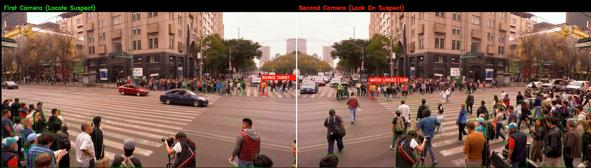

# Cross-Camera Person Re-Identification Pipeline

A real-time, ID-agnostic suspect tracking system that maintains subject identity across disjoint camera views using appearance-based Re-ID and hybrid spatial-semantic scoring.

**Demo:** [YouTube](https://youtu.be/KcyQ4VLN4mo)



---

## Overview

Standard multi-camera tracking systems break when a subject moves between cameras, Racker IDs reset, and there is no mechanism to re-associate the same person across views. 

This pipeline solves that with a three-phase approach: 

1. interactive target selection
2. quality-filtered feature bank construction
3. ID-agnostic cross-camera lock.

---

## Pipeline

### Phase 1 — Interactive Target Selection

YOLOv11x runs inference on Camera 1 with BotSORT tracking. A click-to-select UI lets the operator designate a suspect by clicking their bounding box. The selected tracker ID is passed to Phase 2.

### Phase 2 — Feature Bank Construction (FQA-Filtered)

The pipeline re-runs Camera 1 with a fresh tracker instance to avoid ID drift. For every 3rd frame where the target ID is detected:

- Bounding box aspect ratio is validated (`0.2 < w/h < 0.7`) to filter partial detections
- A padded crop is extracted (`pad_ratio=0.08`)
- A 2048-dim L2-normalized embedding is extracted via ResNet50 (ImageNet pretrained, classification head removed)
- A horizontally flipped augmentation is added for viewpoint robustness

Output: a quality-filtered feature bank of `N` appearance embeddings.

### Phase 3 — Cross-Camera Sniper Lock

Camera 2 runs in pure detection mode (`predict`, no tracker) to eliminate ID dependency entirely. Each detected person is scored against the feature bank using max-pooled cosine similarity.

The lock operates as a two-state machine:

**Acquisition mode** — no active lock
- Ranks all detections by ReID similarity
- Activates lock if Top-1 similarity exceeds threshold (`> 0.76`)

**Tracking mode** — lock active
- Joint scoring: `score = sim + (IoU × 1.5)`
- IoU provides spatial continuity; ReID handles re-identification through occlusion
- Higher confidence threshold (`conf=0.35`) suppresses ghost detections
- Lock released after 20 consecutive missed frames, system returns to acquisition

**Camera 1** runs a parallel sliding-window state machine keyed by tracker ID:
- `UNKNOWN → SUSPECT` if rolling mean similarity > 0.82 over ≥ 3 frames
- `SUSPECT → UNKNOWN` if mean drops below 0.70 over a full 5-frame window

## Stack

| Component                     | Library                                     |
| ----------------------------- | ------------------------------------------- |
| Person detection              | YOLOv11x (Ultralytics)                      |
| Appearance feature extraction | ResNet50 — torchvision, ImageNet pretrained |
| Camera 1 tracking             | BotSORT                                     |
| Video I/O + rendering         | OpenCV                                      |
| Inference                     | PyTorch (CPU)                               |

---

## Setup

```bash
pip install ultralytics torch torchvision opencv-python
```

Place two video files in the project root as `video1.mp4` and `video2.mp4`, then run:

```bash
python evolv_reid_system.py
```

Camera 1 opens in an interactive window. 

**Click any detected person to designate them as the target.** 


The pipeline builds their feature bank automatically, then renders a side-by-side dual-camera output to `evolv_split_demo.mp4`.
